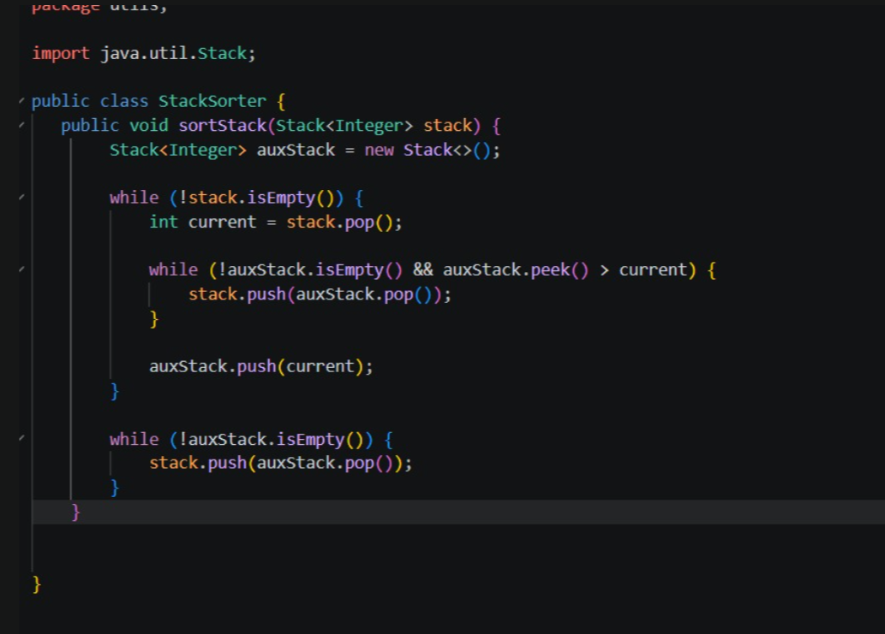
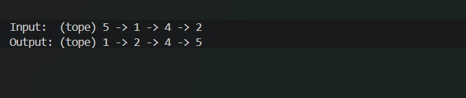
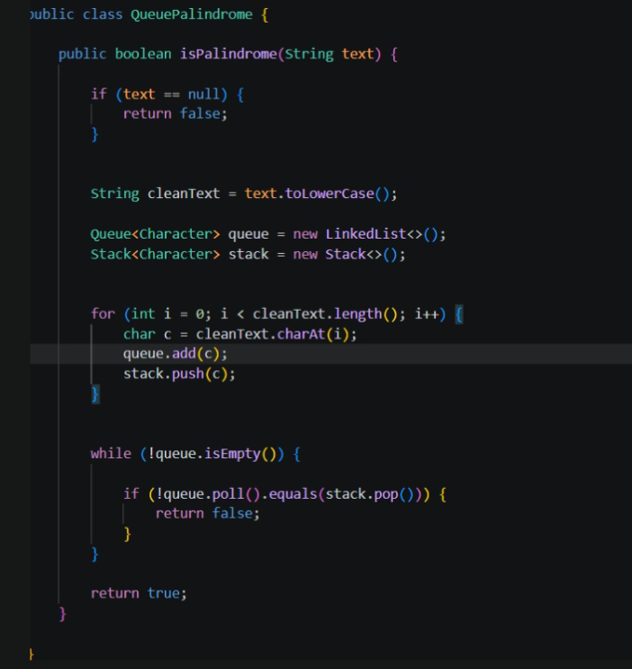
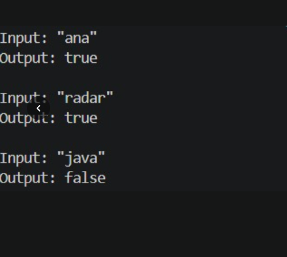

## Titulo de practica: Ejercicios de logica con estructuras 
### Integrantes: Paola Pintado, Jose Vega, Ariel Ushca

### Descripción general del proyecto:

En este  proyecto se desarrollo  en Java con el objetivo de aplicar estructuras de datos lineales utilizando clases, paquetes y programación orientada a objetos.

## Explicacion de los tres ejerccios:

# Ejercicio 01: Validación de Signos

## Descripción

Se implementó la clase "SignValidator", la cual utilizamos una estructura Stack para poder verificar si una cadena de caracteres contiene signos correctamente.
Los símbolos permitidos son:     () , [] , {}

### Imagenes de consola y codigo del ejercicio 1:

# Ejercicio 02: Ordenar Stack

## Descripción

Se implementó la clase "StackSorter", encargada de ordenar un Stack de enteros utilizando solo operaciones propias de Stack.

Operaciones permitidas: push(), pop(), peek(), isEmpty()

### imagenes de consola y codigo del ejercicio 2:

salida:

# Ejercicio 03: Palíndromo usando Colas

## Descripción

Se implementó la clase "QueuePalindrome", que utiliza estructuras Queue para determinar si una palabra es un palíndromo.

Una palabra es palíndroma cuando se lee igual de izquierda a derecha y de derecha a izquierda.

Ejemplos:ana, radar, reconocer

### captura de pantalla de consola y codigo del ejerccio 3:

salida:

## Resumen de evidencias

| Ejercicio | Evidencia de código | Evidencia de consola | Observación |
|------------|-------------------|---------------------|-------------|
| Validación de signos | Incluida | Incluida | Casos válidos e inválidos correctos |
| Ordenar Stack | Incluida | Incluida | Stack ordenado correctamente |
| Palíndromo usando Colas | Incluida | Incluida | En este ejerccio se pudo observar que hay casos verdaderos y falsos correctos |

 

